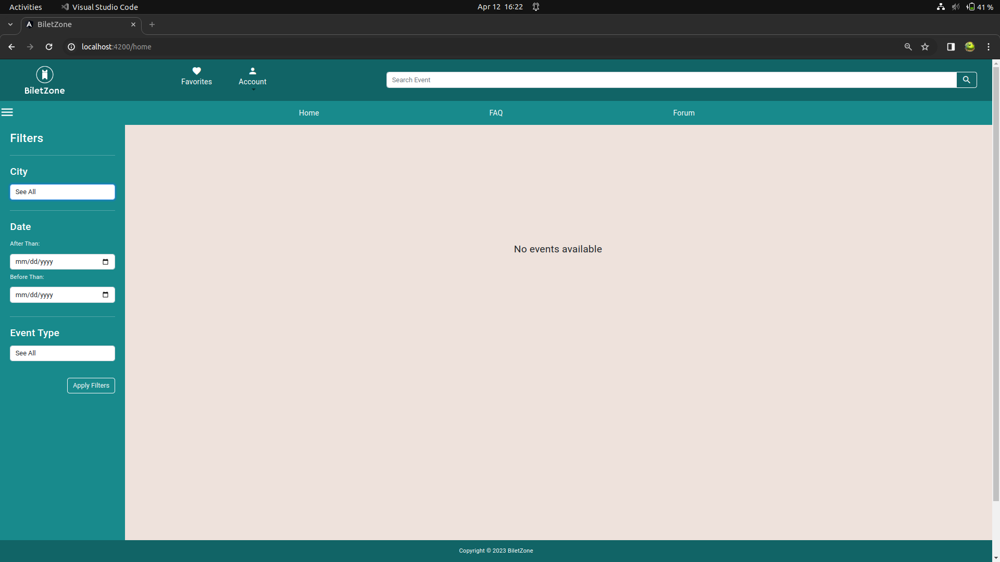
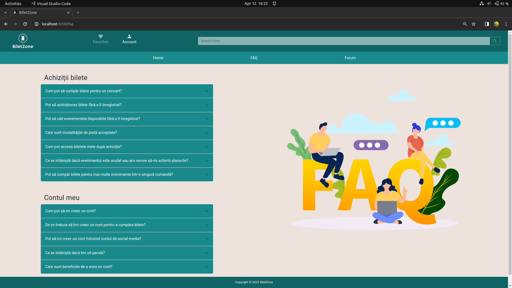
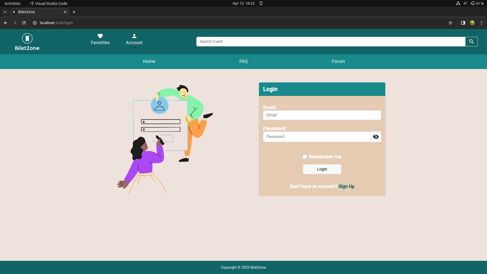
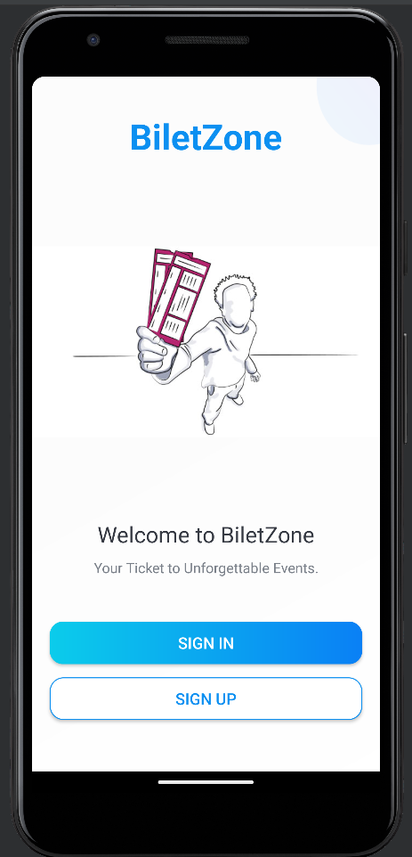
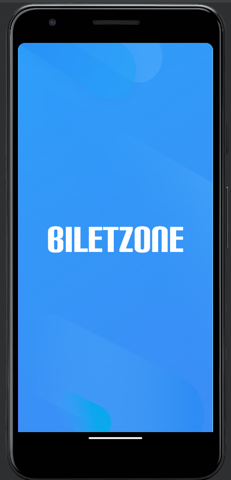
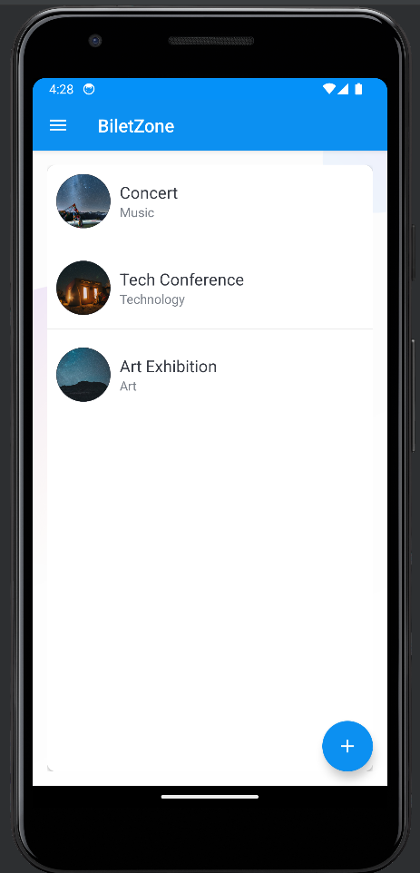

# BiletZone
## Overview
BiletZone is a comprehensive ticketing platform developed with Spring Java for the backend and Angular for the web frontend, along with a simplified Android application built with Kotlin. The platform enables users to browse, search, and purchase tickets for various events. Users can manage their profiles, receive event updates, and participate in event-specific forums.

### Technologies Used
Backend: Java Spring framework
Frontend (Web): Typescript, Angular, Bootstrap
Frontend (Mobile): Kotlin, Android
Database: Relational database (MariaDB)
Microservices: Utilized for modularization and scalability
Asynchronous Communication: WebFlux used for asynchronous communication within microservices, enabling non-blocking and reactive programming.
API Gateway: Orchestrates communication between frontend and microservices, implements JWT token-based authorization and Java Security.
    Implements JWT token-based authorization for secure communication between frontend and backend.
    Utilizes Java Security with filters to restrict access to backend services, ensuring only authorized hosts (such as the frontend) can make calls.
Email Sending: Mail microservice sends confirmation and notification emails to users using JavaMail API.
    JavaMail API utilized for robust and reliable email delivery.
    Supports sending confirmation and notification emails to users seamlessly.

### Web Frontend (Angular)
The browser-related frontend is designed using Angular, Typescript and Bootstrap, maintaining a consistent style, theme, and color scheme across all pages. The user interface is enriched with images and styling effects to enhance the overall design.

### Android Application
A companion Android application is provided with limited functionality due to time constraints. It allows users to register/sign in, view events, and manage their profiles.

## Backend Architecture
The backend architecture consists of multiple microservices orchestrated by an API Gateway:
### API Gateway
Main controller for handling requests from the Angular frontend and Android application.
Performs data preprocessing and forwards requests to the appropriate microservices.
Uses WebFlux for asynchronous communication with microservices.
Implements JWT token-based authorization stored in cookies (Angular) and shared preferences (Android).
Includes logging middleware for easier request and response tracking.

### IDM Microservice
Manages user-related data, including email, password, role, verified flag, and notifications flag.
Utilizes a User table in a relational database.
Provides basic validation for requests and fields.

### Database Microservice
Centralized microservice handling data from multiple tables (e.g., profile, events, tickets).
Implements basic validation for requests and fields.

### Mail Microservice
Sends confirmation and notification emails to users.
Demonstrational mailing feature; in a realistic scenario, a dedicated worker microservice would handle periodic mail tasks.

## Functionality
### User Features
Registration with an option to receive notifications and updates.
Login with a "Remember Me" option (for demonstration purposes).
Email confirmation for account activation.
Viewing, filtering, and searching events.
Adding events to favorites.
Forum for each event to post and view user impressions.
Purchasing tickets with seat selection.
Downloading purchased tickets as PDF.

### Admin Features
Admins are theoretically created directly in the database.
Admin-specific pages for adding/removing users and managing events.
Frontend page for adding admins, generating random strong passwords, and sending them via email.

### Mailing Feature
Users receive event updates, favorite event information, and promotions through email.
Demonstrational; a realistic scenario would involve a dedicated worker for periodic tasks.

<!-- 

 -->
